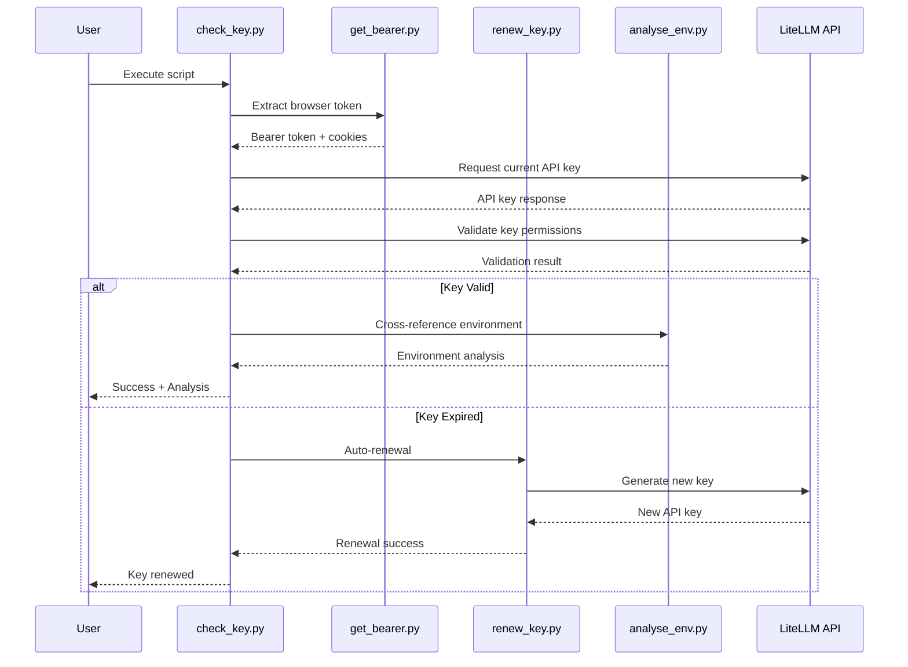

# Architecture Overview

## System Architecture

The LiteLLM Key Updater follows a modular architecture with clear separation of concerns:

```mermaid
graph TB
    subgraph "Core Components"
        A[check_key.py] --> B[get_bearer.py]
        A --> C[renew_key.py]
        A --> D[analyse_env.py]
        A --> E[utils.py]
        
        F[report.py] --> D
        F --> E
        
        G[update_secret_manager.py] --> A
        G --> F
    end
    
    subgraph "External Dependencies"
        H[Browser Cookies]
        I[macOS Keychain]
        J[VSCode Extensions]
        K[Environment Variables]
        L[Configuration Files]
    end
    
    subgraph "LiteLLM API"
        M[/api/v1/auths/api_key]
        N[/api/v1/models]
    end
    
    B --> H
    D --> I
    D --> J
    D --> K
    E --> L
    
    A --> M
    A --> N
    C --> M
```

## Data Flow



## Module Responsibilities

### Authentication Layer
- **get_bearer.py**: Browser session token extraction
- **renew_key.py**: API key generation and renewal
- **check_key.py**: Key validation and orchestration

### Analysis Layer
- **analyse_env.py**: Environment scanning and discovery
- **report.py**: Security analysis and reporting
- **update_secret_manager.py**: Credential synchronization

### Utility Layer  
- **utils.py**: Shared utilities and configuration management
- **config.json**: Centralized configuration
- **install.sh**: Automated setup and deployment

## Security Design

### Principle of Least Privilege
- Scripts only request necessary permissions
- Sensitive operations isolated to specific modules
- Configuration externalized from code

### Defense in Depth
- Multi-layer authentication (browser → bearer token → API key)
- Environment validation and cross-referencing
- Security scanning and hardcoded secret detection

### Safe Defaults
- Obfuscated output for sensitive data
- Secure file permissions recommended
- No hardcoded credentials in source code

## Integration Points

### Browser Integration
- Encrypted cookie extraction via `browser_cookie3`
- Support for Chrome, Edge, Firefox, Brave
- Automatic session detection and token extraction

### System Integration
- macOS Keychain integration for secure storage
- Environment variable management
- VSCode extension credential detection

### API Integration
- RESTful API communication with LiteLLM
- Standardized headers and authentication
- Timeout and error handling

## Error Handling Strategy

### Graceful Degradation
- Fallback mechanisms for authentication failures
- Continue operation with reduced functionality when possible
- Clear error reporting with actionable recommendations

### Auto-Recovery
- Automatic API key renewal on expiration
- Retry logic for transient network failures
- Session refresh when browser tokens expire

### User Feedback
- Color-coded status messages
- Progress indicators for long operations
- Detailed error context and resolution steps