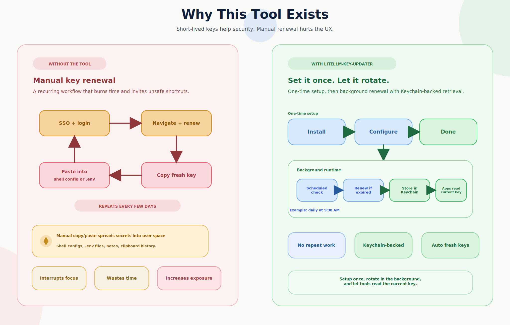

# LiteLLM API Key Updater


Automate LiteLLM API key renewal on macOS for Open-WebUI + LiteLLM Enterprise setups.

<p align="center">
  
</p>

Short-lived keys improve security, but manual renewal is repetitive and easy to handle poorly. This toolkit renews keys in the background, stores them in macOS Keychain, and lets your shell and AI tools read the current key without ongoing copy/paste.

<p align="center">
  
</p>

## Quick Start

### 1. Install

#### Recommended: automated installer
```bash
/bin/zsh -c "$(curl -fsSL https://raw.githubusercontent.com/Enelass/litellm-key-updater/refs/heads/main/install.sh)"
```

#### Manual install
```bash
git clone https://github.com/Enelass/litellm-key-updater.git
cd litellm-key-updater
uv venv && source .venv/bin/activate
uv pip install -e .
```

### 2. Configure

Copy the template and update it with your endpoints:

```bash
cd ~/Applications/LiteLLM-key-updater/
cp config/config.template.json config/config.json
```

Required values in `config/config.json`:

```json
{
  "oauth": {
    "base_url": "https://your-open-webui-instance.com/",
    "api_base_url": "https://your-litellm-enterprise-api.com/"
  }
}
```

- `base_url`: your Open-WebUI frontend URL
- `api_base_url`: your LiteLLM Enterprise API URL

### 3. Set your AI CLI to read the key from Keychain

Add the LiteLLM key from Keychain to the environment variable used by the agentic CLI you connect through LiteLLM.

Examples for common CLIs:

```bash
export LITELLM_MASTER_KEY=$(security find-generic-password -s "LITELLM_API_KEY" -w)
export OPENAI_API_KEY="$LITELLM_MASTER_KEY"        # If you are using an OpenAI-compatible client through LiteLLM
export ANTHROPIC_AUTH_TOKEN="$LITELLM_MASTER_KEY"  # If you are using Claude Code or another Anthropic-compatible client through LiteLLM
export GEMINI_API_KEY="$LITELLM_MASTER_KEY"        # If you are using Gemini CLI through LiteLLM for Azure, Bedrock, or other providers
```

Add the lines you need to `~/.zshrc`, `~/.bash_profile`, or `~/.bashrc`.

Recommended convenience alias:

```bash
alias check_litellm_key='<Directory of the install.sh>/litellm-key-updater/.venv/bin/check-key'
```

Reload your shell:

```bash
source ~/.zshrc
```

### 4. Verify it works

```bash
check-key
```

Useful alternatives:

```bash
python3 main.py check
check-key --help
check_litellm_key
python3 main.py --help
```

### 5. Optional: enable background renewal

```bash
./install.sh --daemon
```

## Features

- Automatic key validation and renewal
- macOS Keychain storage instead of manual secret copy/paste
- Browser session reuse for authenticated renewal
- Security analysis and HTML reporting for hardcoded secrets

## Requirements

- macOS
- Python 3.8+
- Active Open-WebUI session in a supported browser

Supported browsers:

- Google Chrome
- Microsoft Edge
- Mozilla Firefox
- Brave

Not currently supported:

- Safari
- Opera and other less common browsers
- Linux

## Documentation

- [Standalone Scripts Guide](docs/standalone.md): command reference and screenshots
- [Architecture Overview](docs/Architecture.md): system design and data flow
- [Authentication Analysis](docs/auth_analysis.md): detailed auth flow and recovery behavior

## Troubleshooting

- `No bearer token found`: make sure you are already signed into Open-WebUI in a supported browser.
- `API key validation failed`: verify `config/config.json`, confirm the LiteLLM endpoint is reachable, and make sure your browser session is still valid.
- Permission or Keychain prompts: allow macOS Keychain access and keep sensitive config files locked down, for example `chmod 600 config/config.json`.

For deeper diagnostics and command-by-command behavior, use the docs above.

## Contributing

1. Fork the repository.
2. Create a feature branch.
3. Commit your changes.
4. Push the branch.
5. Open a pull request.

## License

MIT License. See [LICENSE](LICENSE).
