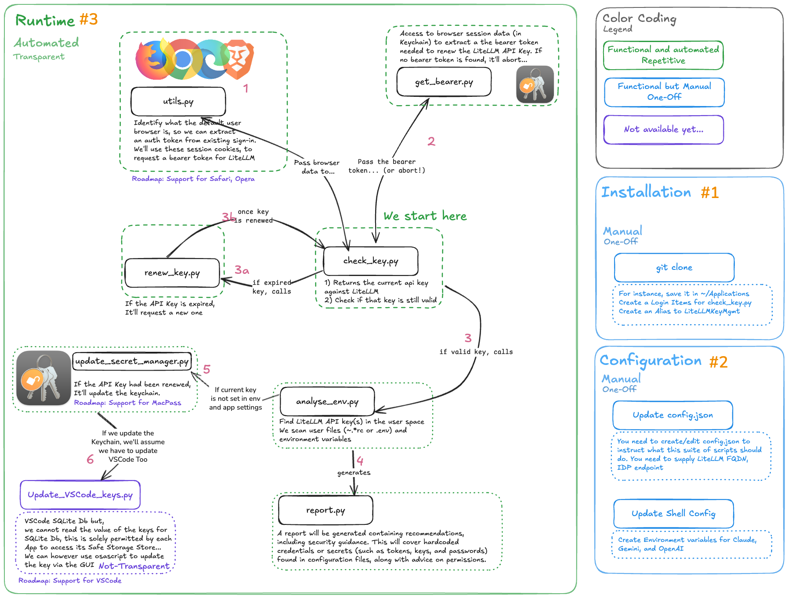

# Architecture Overview

## System Architecture

The LiteLLM Key Updater is built using a modular design where each script has a specific job, making the system easier to maintain and understand:

### Core Architecture Components

- **Browser Token Extraction**: Uses `browser_cookie3` to extract JWT tokens from browser sessions (Chrome, Edge, Firefox, Brave - not Safari due to sandboxing)
- **API Key Management**: Generates new API keys via LiteLLM Enterprise API using extracted bearer tokens
- **Secure Storage**: Stores API keys in macOS Keychain and auto-configures shell environment variables
- **Environment Analysis**: Scans for hardcoded secrets and generates security reports

## Data Flow

### Authentication Flow

1. **User or cron** executes `check-key`
2. **check-key** calls `get-bearer` to extract browser token
3. **get-bearer** returns bearer token + cookies
4. **check-key** requests current API key from LiteLLM API
5. **LiteLLM API** returns API key response
6. **check-key** validates key permissions against API
7. **LiteLLM API** returns validation result

**If Key Valid:**
- **check-key** calls `analyse-env` to cross-reference environment
- **analyse-env** returns environment analysis
- **check-key** returns success + analysis to user

**If Key Expired:**
- **check-key** calls `renew-key` for auto-renewal
- **renew-key** generates new key via LiteLLM API
- **LiteLLM API** returns new API key
- **renew-key** returns renewal success
- **check-key** returns key renewed status to user

## Module Responsibilities

### Authentication Layer
- **get-bearer**: Browser session token extraction
- **renew-key**: API key generation and renewal
- **check-key**: Key validation and orchestration

### Analysis Layer
- **analyse-env**: Environment scanning and discovery
- **generate-report**: Security analysis and reporting
- **update-secretmgr**: Credential synchronization

### Utility Layer  
- **litellm_key_updater.utils**: Shared utilities and configuration management
- **config/config.json**: Centralized configuration
- **install.sh**: Automated setup and deployment

## Security Design

### Principle of Least Privilege
- Scripts only request necessary permissions
- Sensitive operations isolated to specific modules
- Configuration externalized from code

### Defense in Depth
- Multi-layer authentication (browser → bearer token → API key)
- Environment validation and cross-referencing
- Security scanning and hardcoded secret detection

### Safe Defaults
- Obfuscated output for sensitive data
- Secure file permissions recommended
- No hardcoded credentials in source code

## Integration Points

### Browser Integration
- Encrypted cookie extraction via `browser_cookie3`
- Support for Chrome, Edge, Firefox, Brave
- Automatic session detection and token extraction

### System Integration
- macOS Keychain integration for secure storage
- Environment variable management
- VSCode extension credential detection

### API Integration
- RESTful API communication with LiteLLM
- Standardized headers and authentication
- Timeout and error handling

## Error Handling Strategy

### Graceful Degradation
- Fallback mechanisms for authentication failures
- Continue operation with reduced functionality when possible
- Clear error reporting with actionable recommendations

### Auto-Recovery
- Automatic API key renewal on expiration
- Retry logic for transient network failures
- Session refresh when browser tokens expire

### User Feedback
- Color-coded status messages
- Progress indicators for long operations
- Detailed error context and resolution steps

## Browser Support Matrix

- ✅ Chrome (`com.google.chrome`)
- ✅ Edge (`com.microsoft.edgemac`)
- ✅ Firefox (`org.mozilla.firefox`)
- ✅ Brave (`com.brave.Browser`)
- ❌ Safari (sandboxing restrictions)

## Security Considerations

- API keys are obfuscated in logs (first 4 + last 4 chars)
- Keychain integration uses macOS `security` command
- Environment scanning detects hardcoded secrets in shell configs
- HTML reports generated for security analysis
