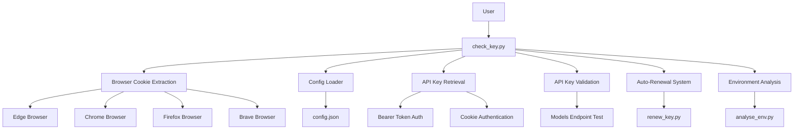
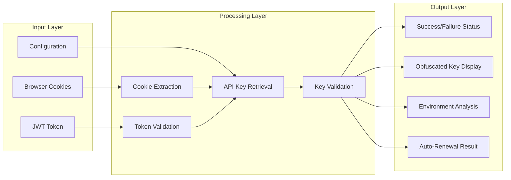

# Authentication Analysis

## Overview

The [`check_key.py`](check_key.py:1) script implements a sophisticated multi-layered authentication and authorization system for validating LiteLLM API keys. This document provides a detailed analysis of the authentication flow with visual representations.

## Authentication Architecture

### System Components



## Authentication Flow Diagram

```mermaid
sequenceDiagram
    participant U as User
    participant CK as check_key.py
    participant GB as get_bearer.py
    participant BR as Browser
    participant API as LiteLLM API
    participant RK as renew_key.py
    participant AE as analyse_env.py

    U->>CK: Execute check_key.py
    CK->>GB: get_browser_info()
    GB-->>CK: Browser details
    
    CK->>GB: get_browser_cookies_for_domain()
    GB->>BR: Extract encrypted cookies
    BR-->>GB: Cookie data + JWT token
    GB-->>CK: Cookies + Bearer token
    
    Note over CK: Authentication Phase
    CK->>API: GET /api/v1/auths/api_key
    Note over CK,API: Headers: Bearer {token} + Cookies
    API-->>CK: Current API key
    
    Note over CK: Authorization Phase  
    CK->>API: GET /api/v1/models (validate key)
    Note over CK,API: Headers: Bearer {api_key}
    
    alt API Key Valid
        API-->>CK: 200 OK + Models list
        CK->>AE: Cross-reference environment
        AE-->>CK: Environment analysis
        CK-->>U: ✅ Success + Analysis
    else API Key Expired (401)
        API-->>CK: 401 Unauthorized
        CK->>RK: Auto-renewal with Bearer token
        RK->>API: POST new API key
        API-->>RK: New API key
        RK-->>CK: New key generated
        CK-->>U: ✅ Key renewed
    else API Key Invalid (403)
        API-->>CK: 403 Forbidden
        CK-->>U: ❌ Insufficient permissions
    end
```



## Security Layers

### Layer 1: Browser Authentication
- **Purpose**: Extract existing user session from browser
- **Method**: Encrypted cookie extraction using [`browser_cookie3`](get_bearer.py:10)
- **Security**: Leverages browser's built-in encryption and session management

```python
# Browser cookie extraction (get_bearer.py:16-49)
def get_browser_cookies_for_domain(browser_id, domain):
    browser_functions = {
        'com.microsoft.edgemac': browser_cookie3.edge,
        'com.google.chrome': browser_cookie3.chrome,
        'com.brave.Browser': browser_cookie3.brave,
        'org.mozilla.firefox': browser_cookie3.firefox
    }
```

### Layer 2: Bearer Token Authentication
- **Purpose**: Authenticate with LiteLLM API using JWT token
- **Token Source**: Extracted from browser cookies (`token` cookie)
- **Format**: `Authorization: Bearer {jwt_token}`

```python
# Bearer token authentication (check_key.py:99)
headers = {
    'Authorization': f'Bearer {final_token}',
    'Content-Type': 'application/json',
    # ... other headers from config.json
}
```

### Layer 3: API Key Authorization  
- **Purpose**: Validate API key permissions and functionality
- **Method**: Test against models endpoint with the retrieved API key
- **Endpoint**: [`/api/v1/models`](config.json:10)

```python
# API key validation (check_key.py:47-48)
response = requests.get(models_url, headers=headers, 
                       cookies=request_cookies, 
                       timeout=config['timeouts']['api_request'])
```

## Configuration Management

### Centralized Configuration
All authentication parameters are managed through [`config.json`](config.json:1):

```json
{
  "oauth": {
    "base_url": "https://your-litellm-instance.com/",
    "api_key_endpoint": "/api/v1/auths/api_key",
    "models_endpoint": "/api/v1/models?return_wildcard_routes=false&include_model_access_groups=false"
  },
  "headers": {
    "user_agent": "Mozilla/5.0 (Macintosh; Intel Mac OS X 10_15_7)...",
    "accept": "application/json, text/plain, */*"
  },
  "timeouts": {
    "api_request": 10
  }
}
```

## Error Handling & Auto-Recovery

### HTTP Status Code Mapping

```mermaid
graph TD
    A[API Response] --> B{Status Code}
    B -->|200| C[✅ Success - Key Valid]
    B -->|401| D[🔄 Auto-Renewal Triggered]
    B -->|403| E[❌ Insufficient Permissions]
    B -->|404| F[❌ No API Key Exists]
    
    D --> G[Call renew_key.py]
    G --> H{Renewal Success?}
    H -->|Yes| I[✅ New Key Generated]
    H -->|No| J[❌ Renewal Failed]
```



### Auto-Renewal Mechanism
When an API key expires (HTTP 401), the system automatically attempts renewal:

```python
# Auto-renewal logic (check_key.py:54-67)
elif response.status_code == 401:
    print("❌ Current API key is expired or invalid", file=sys.stderr)
    print("🔄 Automatically renewing API key...", file=sys.stderr)
    
    try:
        new_key = request_api_key_with_token(final_token, cookies, silent=True)
        if new_key:
            print(f"✅ New API key generated: {obfuscate_api_key(new_key)}")
            return True
    except Exception as e:
        print(f"❌ Error during key renewal: {e}", file=sys.stderr)
        return False
```

## Security Features

### API Key Obfuscation
- **Purpose**: Prevent exposure of sensitive API keys in logs
- **Method**: Show only first 4 and last 4 characters
- **Implementation**: [`obfuscate_key()`](utils.py:64-68)

```python
def obfuscate_key(key):
    """Obfuscate API key for safe display - unified implementation"""
    if not key or len(key) < 8:
        return key
    return key[:4] + "***" + key[-4:]
```

### Environment Cross-Reference
- **Purpose**: Detect mismatches between active API key and environment variables
- **Integration**: Calls [`analyse_env.py`](check_key.py:270-271) with current key
- **Security**: Identifies potential credential inconsistencies

## Data Flow Architecture



## API Endpoints Used

| Endpoint | Purpose | Authentication | HTTP Method |
|----------|---------|----------------|-------------|
| [`/api/v1/auths/api_key`](config.json:7) | Retrieve current API key | Bearer Token + Cookies | GET |
| [`/api/v1/models`](config.json:10) | Validate API key permissions | API Key | GET |

## Header Configuration

The system uses standardized headers from [`config.json`](config.json:16-22) to mimic browser behavior:

```python
headers = {
    'Host': config['oauth']['base_url'].replace('https://', '').split('/')[0],
    'Authorization': f'Bearer {final_token}',  # or f'Bearer {api_key}' for validation
    'Content-Type': 'application/json',
    'Accept': config['headers']['accept'],
    'User-Agent': config['headers']['user_agent'],
    'Origin': config['oauth']['base_url'].rstrip('/'),
    'Referer': config['oauth']['base_url']
}
```

## Integration Points

### External Dependencies
- **[`get_bearer.py`](check_key.py:11)**: Browser cookie extraction and JWT token retrieval
- **[`renew_key.py`](check_key.py:12)**: Automatic API key renewal functionality
- **[`analyse_env.py`](check_key.py:270)**: Environment analysis and cross-referencing
- **[`utils.py`](utils.py:1)**: Configuration loading and utility functions

### Return Value Patterns
```python
# Dual return mode support (check_key.py:86-89)
# return_key=False: Boolean success status
# return_key=True: Tuple (success, api_key)

if return_key:
    return (is_valid, api_key if is_valid else None)
return is_valid
```

## Conclusion

The [`check_key.py`](check_key.py:1) script implements a robust, multi-layered authentication system that:

1. **Extracts credentials** from encrypted browser sessions
2. **Authenticates** using JWT Bearer tokens 
3. **Retrieves** current API keys securely
4. **Validates** API key functionality and permissions
5. **Auto-renews** expired keys automatically
6. **Cross-references** with environment configuration
7. **Obfuscates** sensitive data in output

This architecture provides both security and user convenience while maintaining comprehensive error handling and automatic recovery mechanisms.