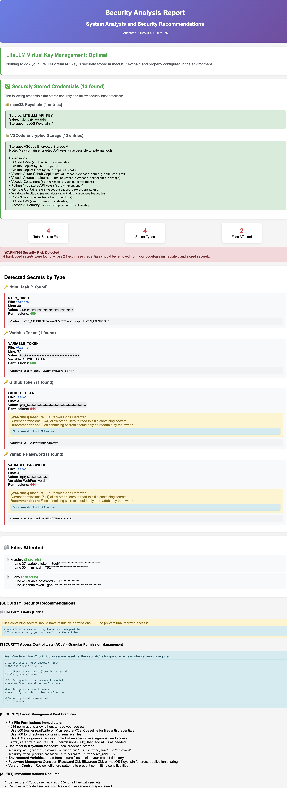

# Standalone Scripts Guide

This document describes each Python script in the LiteLLM Key Updater toolkit and provides visual examples of their output.

## Core Scripts

### `check_key.py` - API Key Validation
**Purpose**: Validates your current API key and checks environment synchronization

**Features**:
- Extracts browser authentication tokens
- Retrieves current API key from LiteLLM server
- Validates key is active by testing against models endpoint
- Cross-references with local environment (keychain, env vars, VSCode)
- Reports mismatches and provides sync recommendations

**Usage**:
```bash
python3 check_key.py
```

**Example Output**:


---

### `get_bearer.py` - Browser Token Extraction
**Purpose**: Extracts and validates browser authentication tokens

**Features**:
- Supports Chrome, Edge, Firefox, Brave browsers
- Handles encrypted cookie stores automatically
- Validates token against LiteLLM API endpoints
- Interactive authentication flow when no session found

**Usage**:
```bash
python3 get_bearer.py
```

**Example Output**:


---

### `renew_key.py` - API Key Generation
**Purpose**: Generates fresh API keys using browser session

**Features**:
- Extracts authenticated bearer token from browser
- Requests new API key from LiteLLM server
- Automatically copies key to clipboard
- Silent mode for scripting integration

**Usage**:
```bash
python3 renew_key.py
```

**Example Output**:


---

### `analyse_env.py` - Environment Analysis
**Purpose**: Comprehensive environment analysis and discovery

**Features**:
- Scans for AI CLI tools (Claude, Gemini, etc.)
- Discovers VSCode AI extensions with API key storage
- Checks macOS Keychain for stored credentials
- Validates environment variable configuration
- Cross-references active key with environment

**Usage**:
```bash
python3 analyse_env.py
```

**Example Output**:


---

### `report.py` - Security Analysis
**Purpose**: Generates comprehensive security reports

**Features**:
- Scans for hardcoded API keys and secrets
- Analyzes file permissions and security risks
- Provides remediation recommendations
- Generates HTML reports with detailed findings
- Secure storage guidance and best practices

**Usage**:
```bash
python3 report.py
```

**Example Output**:


---

### `update_secret_manager.py` - Credential Synchronization
**Purpose**: Updates macOS Keychain with validated API keys

**Features**:
- Security scanner integration (blocks if hardcoded secrets found)
- Keychain-only updates (no environment file modification)
- Current key validation before updates
- Timestamped logging and audit trail

**Usage**:
```bash
python3 update_secret_manager.py
```

**Example Output**:


---

## Utility Scripts

### `utils.py` - Shared Utilities
**Purpose**: Provides common functionality across all scripts

**Features**:
- Configuration loading and validation
- Browser detection and cookie extraction helpers
- Color-coded console output
- System information gathering
- API key obfuscation for safe logging

**Usage**: Imported by other scripts, not run directly

---

### `install.sh` - Automated Installation
**Purpose**: Automates the download and setup process

**Features**:
- Checks for existing installation
- Downloads from GitHub repository
- Sets up virtual environment with uv
- Installs dependencies automatically
- Validates installation completeness

**Usage**:
```bash
./install.sh
```

**Example Output**:


---

## Configuration Files

### `config.json` - Main Configuration
Contains all endpoint URLs, headers, and timeout settings for your LiteLLM instance.

### `config.template.json` - Configuration Template
Template file with placeholder values for initial setup.

---

## Integration Workflows

### Basic Validation Workflow
```bash
# 1. Check current key status
python3 check_key.py

# 2. Generate new key if needed
python3 renew_key.py

# 3. Validate environment sync
python3 analyse_env.py
```

### Security Audit Workflow
```bash
# 1. Run security scan
python3 report.py

# 2. Fix any hardcoded secrets
# (manual step)

# 3. Update keychain safely
python3 update_secret_manager.py
```

### Troubleshooting Workflow
```bash
# 1. Extract browser token manually
python3 get_bearer.py

# 2. Validate token works
python3 check_key.py

# 3. Generate fresh key if needed
python3 renew_key.py
```

---

## Script Dependencies


All scripts depend on `utils.py` for shared functionality and `config.json` for configuration settings.